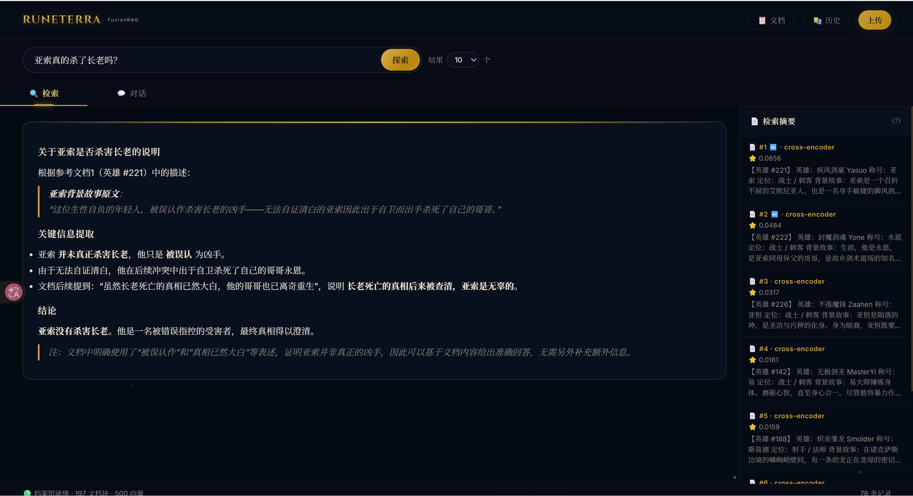

# 🏛️ FusionRAG · 符文之地档案馆

> AI 驱动的英雄联盟宇宙知识检索与对话系统 — 探索符文之地的每一段传奇

<p align="center">
  
</p>

## 🎮 LoL 宇宙特色

- **233 个英雄完整档案** — 通过 Riot Data Dragon 官方 CDN 采集，覆盖所有英雄的背景故事、称号、定位
- **英雄关系分析** — 查询"暗裔一族有哪些成员""阿卡丽和慎是什么关系"，系统检索相关英雄并生成深度分析
- **地区/阵营探索** — 艾欧尼亚、诺克萨斯、弗雷尔卓德… 按地区检索英雄群像
- **持续更新** — 一键运行 `python scripts/fetch_lol_lore.py` 同步最新版本数据

```bash
# 更新英雄数据到最新版本
python scripts/fetch_lol_lore.py
```

## 🧠 核心创新

### 1. Super Brain 融合检索

| 策略 | 说明 |
|------|------|
| **多路召回** | DeepSeek CoT 查询扩展 → 3 个变体并行检索 → RRF 加权融合（原查询权重 3×） |
| **混合检索** | 向量语义检索 + 关键词精确匹配，互补短板 |
| **Cross-Encoder 重排序** | BGE-Reranker-v2-m3 对候选集逐对打分，精度远超单纯 bi-encoder |

### 2. 向量 + 关键词 双引擎

bi-encoder 对精确名称（"疾风剑豪"）匹配弱 → 自动关键词补召回，确保"亚托克斯"搜到 Aatrox、"暗裔"搜到全部暗裔英雄。

### 3. 多轮对话

检索 Tab 旁新增 **💬 对话** Tab — 携带历史上下文的多轮对话，AI 记住你之前聊过的内容，支持追问"他哥哥是谁？""那后来呢？"

### 4. LoL 宇宙主题 UI

Canvas 星空粒子背景、金色符文旋转环、Cinzel 史诗字体、搜索框呼吸灯、流动金边卡片 — 全部纯原生 CSS + Canvas 实现，零外部图片依赖。

### 5. 增强向量库

每个文档块生成 5-10 个多角度问题向量，智能聚类去重。检索时文档向量 + 问题向量加权融合（α=0.7）。

## 🚀 快速开始

### 环境要求

- Python 3.10+
- CUDA 12.1（GPU 推理推荐，CPU 也可运行）
- DeepSeek API Key

### 安装

```bash
git clone https://github.com/你的用户名/FusionRAG.git
cd FusionRAG
pip install -r src/requirements.txt
```

### 配置

```bash
cp .env.example .env
# 编辑 .env，填入你的 DeepSeek API Key
```

### 下载模型

```bash
# 1. 嵌入模型 e5-base-v2（约 420MB）
# 放到 models/e5-base-v2/
# HuggingFace: intfloat/e5-base-v2
# 或使用 modelscope:
pip install modelscope
python -c "from modelscope import snapshot_download; snapshot_download('jerry4243/e5-base-v2', cache_dir='./models')"

# 2. 重排序模型 bge-reranker-v2-m3（约 1.2GB，可选）
# 放到 models/bge-reranker-v2-m3/
# HuggingFace: BAAI/bge-reranker-v2-m3
# 没有重排序模型时会自动回退到 API 或关键词方案
```

### 构建数据库

```bash
# 使用 LoL 英雄数据
cp documents/lol_champions.txt documents/document.txt

# 启动并更新数据库
python src/rag.py
# 选择 Web 模式 → 点击"上传文档" → "更新数据库"
```

### 启动

```bash
python src/rag.py
# 选择 1 → Web 界面模式
# 浏览器自动打开 http://localhost:5000
```

## 📁 项目结构

```
FusionRAG/
├── src/
│   ├── rag.py                  # 入口
│   ├── web_app.py              # Flask 服务 + API
│   ├── smart_retrieval.py      # 智能检索（混合+重排序）
│   ├── reranker.py             # Cross-Encoder 重排序器
│   ├── query_optimizer.py      # 查询扩展 + RRF 融合
│   ├── document_manager.py     # 文档分块 + 向量库构建
│   ├── history_manager.py      # 搜索历史
│   └── template.html           # LoL 宇宙主题 UI
├── scripts/
│   └── fetch_lol_lore.py       # Data Dragon 英雄数据采集
├── documents/
│   ├── lol_champions.txt       # 233 英雄背景故事
│   └── document.txt            # 当前文档库
├── evaluation/                 # 评测脚本 + 数据集
├── training_package/           # 微调训练代码
├── reports/                    # 项目报告
└── docs/screenshots/           # 界面截图
```

## 🛠️ 技术栈

| 组件 | 技术 |
|------|------|
| 嵌入模型 | intfloat/e5-base-v2 |
| 重排序模型 | BAAI/bge-reranker-v2-m3 |
| LLM | DeepSeek-chat |
| 向量检索 | NumPy 点积 + 关键词匹配 |
| Web 框架 | Flask + SSE 流式响应 |
| 分块策略 | RecursiveCharacterTextSplitter（300 chars / 30 overlap） |

## 📊 评测

在 SQuAD + HotpotQA 上的 Bootstrap 稳定性评估，FusionRAG 在 Recall@5 和 MRR 上显著优于 Normal RAG。

详见 `evaluation/stable_eval_fusionrag.py` 和 `reports/` 目录。

## 📝 License

MIT

---

<p align="center">
  <i>"效法羲和驭天马，志在长空牧群星。" — 南京航空航天大学校歌</i>
</p>
