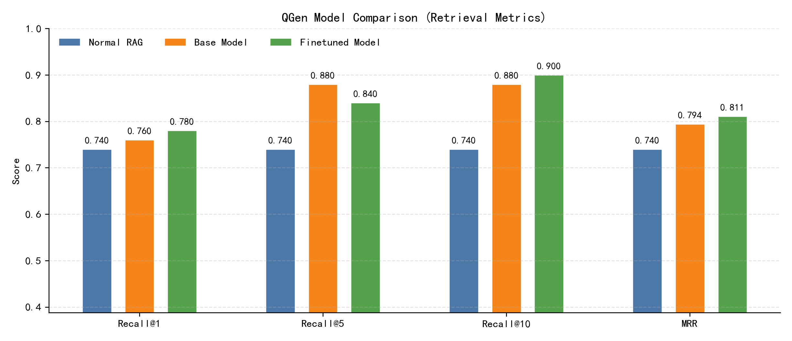

# 南京航空航天大学大学生创新训练计划项目  
# 研究总结报告

项目名称：用于大模型RAG文档检索的嵌入方法研究  
项目负责人：李秋贤（162350227）  
项目成员：陈天宇（162350228）、钟兆丰（162350225）、蔡正钰（162350226）  
指导教师：戴洪良（工号：70207678）  
研究时间：2025年04月～2026年04月  
软件系统名称：智融检索（FusionRAG）

---

## 目录

一、研究意义与价值  
1.1 研究背景  
1.2 问题定义与挑战  
1.3 研究目标与技术路线  

二、项目研究过程（研究内容与方法）  
2.1 总体架构与模块划分  
2.2 数据与评测体系  
2.3 索引端：文档预处理与向量化  
2.4 索引端：生成式问题增强索引  
2.5 索引端：语义聚类去重（Smart Clustering）  
2.6 检索端：加权融合检索（Weighted Fusion）  
2.7 检索端：轻量级重排序（Hybrid Rerank）  
2.8 检索端：CoT查询扩展与RRF多查询融合（Super Brain）  
2.9 系统工程实现与部署形态（Web/CLI）  

三、结论与成果  
3.1 核心实验结果与分析  
3.2 软件系统与可复现材料  
3.3 理论价值与实践意义  

四、项目特色与创新点  
4.1 “嵌入方法研究”的定位与创新点  
4.2 创新算法与关键参数总结  

五、应用前景  
5.1 典型应用场景  
5.2 落地路径与工程化建议  

六、收获与体会、问题与展望  
6.1 收获与体会  
6.2 尚存在的问题  
6.3 进一步研究设想  

---

## 一、研究意义与价值

### 1.1 研究背景

　　RAG（Retrieval-Augmented Generation，检索增强生成）是一种将外部知识检索与大语言模型生成能力结合的技术框架。其核心思想是：在生成回答之前，先从知识库中检索与用户问题相关的证据文本，再将证据与问题一并输入生成模型，从而提升回答的真实性、可溯源性与专业性。与“端到端凭参数记忆回答”相比，RAG在知识更新频繁、专业性强或对事实准确性要求极高的领域更具优势，例如医疗、法律、教育与航空航天等场景。  
　　然而，RAG的整体效果往往受限于检索阶段：如果检索召回的证据不准确或排序靠后，即使生成模型能力很强，也可能因缺乏关键事实而产生幻觉或答非所问。换言之，检索阶段决定了生成阶段的“信息上限”。因此，如何提升RAG检索质量，是RAG落地应用的关键基础问题。  
　　本项目聚焦于RAG的“文档检索”部分，研究“嵌入向量如何构建与组织”以及“检索时如何融合与重排”，目标是让关键证据在Top-K结果中更容易被召回并尽可能靠前，从而减轻大模型阅读负担、提升最终回答准确性与稳定性。

### 1.2 问题定义与挑战

　　主流RAG检索常采用语义向量检索：分别将用户问题（Query）与文档片段（Passage）编码为向量，通过余弦相似度或内积进行Top-K召回。这一范式具有可扩展、语义泛化能力强等优点，但在真实应用与多跳问答场景中仍存在典型挑战：  
　　（1）问法差异与语义鸿沟：用户问题的表达方式与知识库文本的措辞、结构存在明显差异，导致“真正可回答问题的证据”不一定在向量空间与Query相近。  
　　（2）多跳推理与桥接证据：HotpotQA等多跳任务常需要先找到“桥梁文档”，再由桥梁文档指向最终证据；单次检索往往无法直接命中关键链路。  
　　（3）关键词约束不足：纯语义检索对实体名、型号、年份等字面约束不够敏感，可能把“语义相近但细节不符”的证据排到前面。  
　　（4）生成式增强的噪声与成本：用大模型生成“潜在问题”以增强索引虽然能提升覆盖面，但也可能带来冗余、幻觉与计算成本上升的问题。  
　　因此，本项目在“提升召回与排序”的同时，还必须控制噪声与成本，形成可落地、可复现、可解释的工程方案。

### 1.3 研究目标与技术路线

　　本项目的研究目标包括：  
　　（1）构建面向RAG检索的嵌入与索引体系，提升检索首位命中（Recall@1）与排序质量（MRR）。  
　　（2）在保持工程可落地的前提下，引入生成式增强与多策略融合，提升多跳问题检索鲁棒性。  
　　（3）建立可复现实验评测流程，覆盖单跳与多跳数据集（SQuAD、HotpotQA），输出指标与报告材料。  
　　技术路线如下：  
　　① 基础嵌入：采用E5（e5-base-v2）作为语义编码器，遵循query/passage前缀规范。  
　　② 生成式增强索引：对每个文档块生成若干“潜在问题”，将问题向量与文档向量共同入库，缩短“问法—证据”语义差异。  
　　③ 索引去噪：对生成问题进行语义聚类去重（Smart Clustering），减少冗余与噪声、控制向量规模。  
　　④ 检索融合：对文档向量相似度与问题向量相似度做加权融合（Weighted Fusion）。  
　　⑤ 轻量重排：对候选集加入字符覆盖率重排序（Hybrid Rerank），补足关键词约束。  
　　⑥ 复杂问题增强：对多跳问题做CoT查询扩展，并用RRF对多查询结果融合（Super Brain）。  
　　⑦ 系统工程：实现Web/CLI交互、数据管理、评测脚本与自动化报告输出，形成可交付的软件系统“智融检索（FusionRAG）”。

---

## 二、项目研究过程（研究内容与方法）

### 2.1 总体架构与模块划分

　　本系统以“索引构建（Indexing）—检索（Retrieval）—生成（Generation）”为主流程，其中本项目研究重点集中在Indexing与Retrieval两部分。整体模块如下：  
　　（1）文档管理与预处理模块：文档读取、文本清洗、分块策略、来源记录与重复检测。  
　　（2）嵌入向量模块：E5编码器加载、Query/Passage前缀规范、向量归一化与存储。  
　　（3）生成式增强模块：对文档块生成潜在问题，形成“问题—向量”增强索引。  
　　（4）索引优化模块：语义聚类去重、质量过滤、冗余控制与参数化配置。  
　　（5）检索融合与重排模块：加权融合、候选集构造、轻量级重排序。  
　　（6）复杂查询增强模块：CoT查询扩展、多查询RRF融合。  
　　（7）评测与报告模块：数据集加载、指标计算（Recall@K、MRR等）、结果可视化与Markdown/PDF报告输出。  
　　（8）交互与应用模块：Web与命令行两种形态，支持上传、更新、搜索与历史记录，并可对接DeepSeek API进行回答生成。

### 2.2 数据与评测体系

　　为避免“只看个例”的主观判断，本项目构建了脚本化评测体系：  
　　（1）数据集：  
　　- SQuAD：单跳事实问答，检验基础检索稳健性。  
　　- HotpotQA：多跳推理问答，检验桥接证据召回能力与复杂Query鲁棒性。  
　　（2）指标：  
　　- Recall@K：正确证据是否出现在Top-K结果中，用于衡量“覆盖率”。  
　　- MRR（Mean Reciprocal Rank）：正确证据的倒数排名均值，用于衡量“排序质量”。  
　　（3）评测口径：  
　　- 对于分块文档，正确性匹配采用“文档名精确匹配”或“文本包含关系匹配”两种策略。  
　　- 不同实验脚本针对不同模块（如Super Brain、问题生成策略）可能采用不同口径，以确保实验成本可控且对比公平。  
　　（4）可复现输出：  
　　- evaluation目录提供评测脚本与数据样本。  
　　- reports目录统一输出阶段性报告、图表与PDF材料。

### 2.3 索引端：文档预处理与向量化

　　（1）文档分块：将长文档拆分为多个chunk，既保证单块语义完整，又控制向量编码输入长度。分块策略需在“信息完整性”与“检索粒度”之间平衡；粒度过大易引入噪声，粒度过小又可能导致证据分散。  
　　（2）向量化：采用E5-base-v2对文档块进行编码，并使用`normalize_embeddings=True`归一化，以便内积等价于余弦相似度。  
　　（3）前缀规范：E5训练时约定Query使用`query:`前缀，Passage使用`passage:`前缀。本项目严格遵循，以提升向量空间一致性与相似度分布质量。  
　　（4）数据库结构：将文档块文本与向量序列化到JSON数据库，并维护来源信息`document_sources`以便评测与追踪。

### 2.4 索引端：生成式问题增强索引

　　生成式增强索引的核心思想是：让文档不仅以“原文语义”入库，也以“用户可能的问法”入库，从而缩短Query与证据之间的语义鸿沟。具体做法如下：  
　　（1）对每个文档chunk调用大模型生成若干“潜在问题”，要求问题覆盖关键信息点、具备多角度（Who/When/Where/Why/How等）且自包含。  
　　（2）将生成问题同样编码为向量，并与文档向量共同写入数据库；同时记录向量类型（document/question）与其所属chunk映射（vector_to_chunk_map）。  
　　（3）生成策略并非简单“直接生成”，而是引入关键词抽取与CoT约束：先提取实体、时间、地点、核心概念等关键词作为锚点，再要求模型按步骤分析关键信息后生成问题，以降低泛化与幻觉问题。  
　　（4）质量过滤：对生成问题进行长度与格式过滤，保证问题可用性并控制极端长句带来的噪声。  
　　该模块的收益是：当用户问题更接近“潜在问题”的表达时，可通过问题向量直接命中对应chunk；同时文档向量仍作为稳定基座，避免被生成噪声拖垮。

### 2.5 索引端：语义聚类去重（Smart Clustering）

　　生成式增强带来一个现实问题：同一chunk的多个问题常是同义改写，全部入库会造成向量库膨胀与分数稀释。为此，本项目实现语义聚类去重（Smart Clustering）：  
　　（1）对同一chunk生成的问题向量计算余弦相似度矩阵。  
　　（2）采用贪心去重策略：优先保留更长、信息量更丰富的问题作为“代表”，将与其相似度超过阈值（如0.90）的其他问题剔除。  
　　（3）该策略等价于“过生成→再筛选”，既保证覆盖率，又控制冗余。  
　　该模块的工程意义在于：显著降低索引规模、减少噪声向量、提升候选集多样性，从而改善检索稳定性。

### 2.6 检索端：加权融合检索（Weighted Fusion）

　　检索阶段面对两类信号：文档向量相似度（稳定但问法鸿沟大）与问题向量相似度（更贴近问法但可能有噪声）。本项目采用加权融合：  
　　（1）对库中所有向量计算与Query向量的相似度。  
　　（2）按chunk聚合两类分数：  
　　- `doc_score`：该chunk文档向量相似度；  
　　- `max_q_score`：该chunk所有问题向量相似度的最大值；  
　　（3）最终分数：  
　　`FinalScore = 0.7 * doc_score + 0.3 * max_q_score`  
　　该权重体现“文档为主、问题为辅”的稳健性原则：在问题向量有效时增强召回，在问题向量噪声时不至于主导排序。为进一步鲁棒，若某chunk没有问题向量或问题生成失败，系统会以doc_score回填max_q_score以避免不公平惩罚。  
　　该模块在无需额外训练的前提下，实现了“结构性增强索引”与“稳健融合检索”的协同。

图2.1　加权融合检索（Weighted Fusion）流程示意：按chunk聚合doc_score与max_q_score，并以0.7/0.3融合得到FinalScore

### 2.7 检索端：轻量级重排序（Hybrid Rerank）

　　为解决“语义相似但关键词不对”的问题，本项目在Top候选集上加入轻量级重排序：  
　　（1）从Query中去除常见停用字符，得到关键字符集合。  
　　（2）计算每个候选文档对Query关键字符的覆盖率（出现比例）。  
　　（3）对语义相似度较高的候选（如原始分数>0.6）执行分数微调：  
　　`NewScore = 0.8 * SemanticScore + 0.2 * Coverage`  
　　该方法无需分词与额外模型，适配中文场景且工程开销极低；通过触发门槛避免把不相关结果强行提升。  
　　实践中，该模块可显著提升实体/型号/指令类Query的排序可靠性。

图2.2　轻量级重排序（Hybrid Rerank）示意：基于关键字符覆盖率对高语义相似候选进行门槛触发的分数微调

### 2.8 检索端：CoT查询扩展与RRF多查询融合（Super Brain）

　　多跳问题的难点在于“桥接证据”。仅依赖单一Query往往缺少关键锚点，导致检索视角单一。本项目实现“Super Brain”检索：  
　　（1）CoT查询扩展：利用大模型对原始问题生成3个变体，包括更具体版本、同义泛化版本、以及隐含关联的桥接视角问题，从而覆盖不同检索路径。  
　　（2）RRF融合：对原Query与扩展Query的检索结果使用互惠秩融合（Reciprocal Rank Fusion）。给原始Query更高权重（例如3.0），扩展Query权重为1.0，融合公式为：  
　　`Score(doc)=Σ Weight(q) * 1/(k + Rank_q(doc))`  
　　其中k为平滑常数（如60），用于避免Top位置过度尖峰。  
　　该模块的理论直觉是：若某文档在多个检索视角下都靠前，则其作为证据更可信；融合可降低单次检索的偶然噪声。  
　　该模块在HotpotQA等多跳场景中体现出更强的召回鲁棒性。

### 2.8.1 补充：问题生成模型微调（QGen Finetune）

　　在“生成式增强索引”中，问题生成质量直接决定问题向量是否能有效命中用户问法。为提升QGen稳定性与任务贴合度，本项目对本地问题生成模型进行微调，并将其作为索引端增强能力的补充方案。  
　　（1）模型设置：  
　　- Base Model：`google/flan-t5-xl`  
　　- Finetuned Model：`output_model/checkpoint-345`  
　　（2）评测口径：将不同模型生成的问题用于索引增强，在同一检索评测流程下比较Recall@K与MRR。  
　　（3）核心结果（来自`evaluation/expert_comparison_report.md`）：  
　　- Normal RAG：Recall@1=0.74，Recall@5=0.74，Recall@10=0.74，MRR=0.740  
　　- Base Model：Recall@1=0.76，Recall@5=0.88，Recall@10=0.88，MRR=0.794  
　　- Finetuned Model：Recall@1=0.78，Recall@5=0.84，Recall@10=0.90，MRR=0.811  
　　（4）结论：相较Base，微调模型在Recall@1、Recall@10与MRR上均有提升（+0.02、+0.02、+0.017），说明微调后的问题生成更有利于“首位命中”与“排序靠前”。Recall@5的小幅回落提示不同K位点仍存在权衡，后续可通过数据扩充与损失加权继续优化。

图2.3　问题生成模型微调效果对比：Normal RAG、Base Model与Finetuned Model在Recall@K与MRR上的定量结果

图2.4　CoT查询扩展与RRF多查询融合（Super Brain）流程示意：多视角查询检索后以互惠秩融合综合排序

### 2.9 系统工程实现与部署形态（Web/CLI）

　　本项目完成了可运行软件原型“智融检索（FusionRAG）”：  
　　（1）交互方式：提供Web与命令行两种入口，支持上传、更新、搜索与历史记录；生成侧可集成DeepSeek API输出回答。  
　　（2）工程可复现：评测脚本与报告自动生成统一放置于evaluation与reports目录；项目支持离线运行（本地E5模型缓存）与在线能力（API）。  
　　（3）可交付性：形成可打包上传的系统目录与完整材料，便于结项与验收。

图2.5　系统工程实现与部署形态示意：Web/CLI入口、核心检索服务、向量库、评测报告与可选生成模型的协同关系

---

## 三、结论与成果

### 3.1 核心实验结果与分析

　　本项目在SQuAD与HotpotQA上开展了对比评测，并输出Recall@K与MRR等指标。总体结论为：  
　　（1）在多跳推理场景（HotpotQA）中，引入CoT查询扩展与RRF融合可提升首位命中与排序质量，体现“多视角检索”对桥接证据的帮助。  
　　（2）在单跳事实场景（SQuAD）中，系统保持较高召回稳定性（如Recall@10可达到100%），说明引入增强逻辑未显著损害基础能力。  
　　（3）生成式增强索引带来收益的同时也引入噪声风险；通过“语义聚类去重 + 加权融合 + 重排门槛”形成稳健控制机制，使系统在多数场景下更稳定。  
　　（4）轻量级重排序对实体约束类问题具有明显正向作用，弥补纯向量检索的字面匹配不足。  
　　这些结论均由脚本化评测与报告材料支撑，可复现、可解释。

### 3.1.1 Bootstrap验证FusionRAG：正向提升趋势与置信区间

　　本节给出FusionRAG相对Normal RAG的稳定性验证，包含实验背景、数据来源、指标定义与统计方法，保证结论可解释、可复现。

　　（1）实验背景（为什么要做Bootstrap）  
　　- RAG检索对样本组成较敏感：不同题型（单跳/多跳）、不同问法分布会导致单次评测出现波动。  
　　- 若只报告一次跑分，可能出现“偶然抽到有利样本”的误判。  
　　- 因此采用Bootstrap：在固定同一文档库与同一检索参数的前提下，仅对query集合做有放回重采样，估计指标差值Δ的分布与置信区间，从而更客观地描述“平均趋势”和“波动范围”。

　　（2）数据来源与样本构造（用的数据是什么）  
　　- HotpotQA子集：从本地样本文件 `evaluation/hotpot_50_samples.json` 读取前50条样本（字段包含`id/question/content/answer/source`）。  
　　- SQuAD子集：从 `evaluation/squad_data.json` 读取数据后按“文档去重”抽取前50篇unique documents，并为每篇构造一条样本（`id/question/content/answer/source`），其中question来自该文档下的一条SQuAD问题。  
　　- 合并后总样本数：100（HotpotQA=50，SQuAD=50）。  
　　- 说明：本节评测使用的是“可复现抽样子集”，其目的在于对比检索策略与统计稳定性，而非宣称在完整公开测试集上的最终成绩。

　　（3）对照方法与固定条件（公平性保证）  
　　- 对照组：Normal RAG（仅文档向量检索）。  
　　- 实验组：FusionRAG（文档向量 + 问题向量的加权融合检索）。  
　　- 固定条件：  
　　　a) 使用同一批文档库（不在每次Bootstrap中重建索引）；  
　　　b) 使用同一Embedding模型与同一分块/向量库配置；  
　　　c) 每条query的“正确文档”定义不变（样本已绑定所属doc_index）。  
　　- 目的：把差异尽量归因于“检索策略本身”，而不是索引随机性或重建噪声。

　　（4）指标定义（Recall@K / MRR 的含义）  
　　- Recall@K：对每个query取Top-K候选文档；若“正确文档”出现在Top-K中记为1，否则0；对所有query取平均。  
　　　Recall@1强调“首位命中”，对RAG生成质量影响最大；Recall@10反映“召回底座是否稳”。  
　　- MRR（Mean Reciprocal Rank）：对每个query，若正确文档排名为r，则RR=1/r；否则RR=0；MRR为所有query的平均RR。  
　　　MRR强调“平均排位是否靠前”，比单纯召回更能刻画排序质量。  
　　- Δ指标：Δ = FusionRAG - Normal RAG（分别对Recall@1与MRR计算），用于量化改进幅度。

　　（5）Bootstrap方案与置信区间（CI）计算  
　　- 分层Bootstrap：HotpotQA与SQuAD分别在各自样本集合内有放回抽样，保证每次重采样仍为50+50，避免类别比例变化带来的偏差。  
　　- 重复次数：N_BOOT=2000；随机种子：SEED=42。  
　　- 每次重采样：在抽到的query子集上分别计算Normal与Fusion的Recall@1/MRR，并记录Δ。  
　　- 95%CI：采用Percentile CI，取Δ分布的2.5%与97.5%分位数作为区间端点；同时报告Δ均值作为“总体趋势”。

　　（6）结果：单次全量与Bootstrap统计（Overall）  
　　- 单次全量（100%样本）Overall：Normal RAG Recall@1=0.8700，FusionRAG Recall@1=0.8800；MRR=0.9257→0.9287。  
　　- Bootstrap（Δ=FusionRAG-Normal）：  
　　　a) Δ Recall@1 均值：+0.0102，95%CI：[-0.0400, +0.0600]；  
　　　b) Δ MRR 均值：+0.0032，95%CI：[-0.0237, +0.0323]。  
　　- 解释：Δ均值为正，说明总体趋势向好；CI跨0，说明在该样本规模下仍存在抽样波动，提升不一定在所有子集上都显著。

　　（7）分数据集解读与结论表达口径  
　　- SQuAD（单跳）更容易从“问题向量对齐问法”的机制中获益；  
　　- HotpotQA（多跳）对桥接证据更敏感，QGen质量与融合策略稍有偏差就可能带来波动；  
　　- 建议写法：  
　　“FusionRAG在Overall维度呈现正向提升趋势，并通过分层Bootstrap（N_BOOT=2000）给出95%置信区间，结论较单次跑分更稳健、更可解释；同时在多跳任务上仍存在波动空间，后续将通过多跳专用QGen与权重自适应进一步提升稳定性。”

图3.1　FusionRAG相对Normal RAG的Δ Recall@1分布与95%Bootstrap置信区间（分层重采样，N_BOOT=2000）

图3.2　FusionRAG相对Normal RAG的Δ MRR分布与95%Bootstrap置信区间（分层重采样，N_BOOT=2000）

### 3.2 软件系统与可复现材料

　　项目成果以“软件系统 + 报告材料 + 实验数据与脚本”三类形式交付：  
　　（1）软件系统：智融检索（FusionRAG），包含索引构建、融合检索、重排序、Super Brain增强检索以及Web/CLI交互。  
　　（2）报告材料：综合评估报告、问题生成报告、聚类与重排优化报告、可视化报告、结项方案与答辩材料。  
　　（3）实验复现：SQuAD与HotpotQA的样本数据、评测脚本与可视化输出，便于复核与二次扩展。  
　　上述材料已整理入可打包目录，满足结项提交的完整性要求。

### 3.3 理论价值与实践意义

　　理论层面，本项目强调“嵌入方法”不仅是选用某个编码模型，而是包含“向量组织方式（文档向量+问题向量）”与“融合/重排策略”的系统性设计；从结构上解释并验证了生成式索引可缩短问法差异带来的语义鸿沟。  
　　实践层面，本项目形成了可运行原型与工程化评测体系，能够直接服务于面向知识库的问答、客服与专业资料检索场景。尤其在需要证据可溯源、对准确性要求高的领域，本系统可作为RAG检索增强的可落地基座。

---

## 四、项目特色与创新点

### 4.1 “嵌入方法研究”的定位与创新点

　　本项目的特色在于：不局限于“替换embedding模型”，而是研究“让embedding更可用”的体系化方法。具体包括：  
　　（1）生成式增强索引：将文档的潜在问法显式建模为问题向量，与文档向量共同构成检索空间。  
　　（2）索引去噪与规模控制：通过语义聚类去重削减冗余，保证增强索引的质量与效率。  
　　（3）融合与重排：用加权融合稳健整合两类信号，再用轻量重排补足字面约束。  
　　（4）复杂问题增强：CoT扩展提供多视角检索路径，RRF融合在排序层面提高鲁棒性。  
　　该系列设计使系统在多跳与复杂问法场景中更接近真实应用需求。

### 4.2 创新算法与关键参数总结

　　为保证全文术语统一，本文采用以下缩写与符号：  
　　- Query：用户问题；Passage：文档块；Embedding：嵌入向量。  
　　- Recall@K：前K召回率；MRR：平均倒数排名。  
　　- CoT：Chain-of-Thought（思维链）；RRF：Reciprocal Rank Fusion（互惠秩融合）。  
　　关键算法与参数：  
　　（1）Weighted Fusion：`FinalScore = 0.7*DocScore + 0.3*MaxQuestionScore`。  
　　（2）Smart Clustering：余弦相似度阈值约0.90，长度优先保留代表问题。  
　　（3）Hybrid Rerank：`NewScore = 0.8*Semantic + 0.2*Coverage`，且仅对Semantic>0.6触发。  
　　（4）RRF：`Score(doc)=Σ Weight(q) * 1/(k + Rank)`，原Query权重高于扩展Query，k取60用于平滑。  
　　这些参数来自多轮小规模对比实验与误差分析，目标是在提升复杂场景性能的同时控制噪声影响。

---

## 五、应用前景

### 5.1 典型应用场景

　　（1）课程/科研知识库问答：对课程讲义、论文笔记、实验文档建立可追溯问答系统。  
　　（2）科研与工程资料检索：在航空航天等专业领域，快速定位技术规范、设计说明与试验记录。  
　　（3）企业内部知识管理与客服：将FAQ、产品说明、规章制度等文档结构化入库并提供证据可追溯的回答。  
　　（4）公共服务与政务知识库：对政策文件、办事指南等文档实现更稳定的检索与回答生成。  
　　在这些场景中，融合检索与重排序机制能有效提升“证据靠前程度”，从而提升最终生成的可信度与一致性。

### 5.2 落地路径与工程化建议

　　（1）离线索引构建：对大规模文档进行离线批处理，减少在线生成式增强的成本。  
　　（2）增量更新：仅对新增或变更文档重建向量，避免全库重算。  
　　（3）模型本地化：关键组件（Embedding与QGen）可逐步本地部署，降低API依赖与费用。  
　　（4）加入精排：在候选集上进一步引入Cross-Encoder等精排模型，有望提升Recall@1与MRR。  
　　（5）监控与回溯：保留检索证据、分数与生成日志，便于线上质量监控与迭代。

---

## 六、收获与体会、问题与展望

### 6.1 收获与体会

　　（1）研究方法收获：仅靠“更大的模型”并不能解决所有问题，结构性改造（索引组织、融合策略、噪声控制）往往能带来更稳定的收益。  
　　（2）工程经验收获：评测体系与可复现流程极其关键；只有把实验脚本、数据样本、指标输出标准化，才能进行可解释的优化。  
　　（3）团队协作收获：通过明确分工（嵌入与检索实现、对比实验、系统集成与材料整理）与定期同步，确保了项目按计划推进。  
　　（4）结论观念收获：RAG的检索目标不仅是“召回到”，更重要是“排在前面”；MRR与Recall@1的提升对最终生成质量意义更大。

### 6.2 尚存在的问题

　　（1）生成式索引的成本：问题生成与向量化在大规模语料下会显著增加索引构建时间与费用。  
　　（2）生成噪声的上限：尽管有过滤与去重，仍可能出现少量幻觉问题向量，影响局部排序。  
　　（3）评测口径统一：不同数据集与分块策略导致“正确性匹配”方式不同，需要更统一的标注与评测基准。  
　　（4）缺少高阶精排：当前重排为轻量级规则信号，尚未引入更强的学习式reranker。

### 6.3 进一步研究设想

　　（1）训练或蒸馏本地QGen模型：用项目数据与公开数据训练专用问题生成模型，统一风格并降低成本。  
　　（2）引入Cross-Encoder精排：在加权融合与RRF之后加入精排模型，对Top-N候选重新打分。  
　　（3）更真实场景评测：引入学院课程资料、科研文档等真实语料，构建更贴近应用的评测集与用户回放测试。  
　　（4）更强的混合检索：在向量检索基础上融合BM25等稀疏检索，进一步提升实体与关键词约束场景表现。  
　　（5）可解释性增强：输出“命中来源（文档/问题/融合/重排）”与证据链路，提升可审计性。

---

（完）

